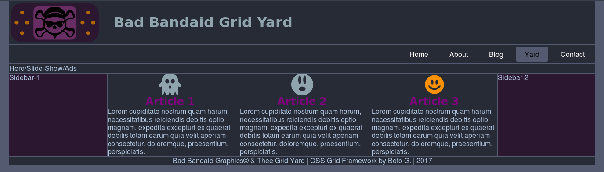

# Bad Bandaid CSS Grid Framework

### This is an ongoing, responsive CSS Grid Layout framework project.
***
My attempt on creating CSS Grid Layout framework.  [CSS Grid Layout](https://developer.mozilla.org/en-US/docs/Web/CSS/CSS_Grid_Layout/Basic_Concepts_of_Grid_Layout) "introduces a two-dimensional grid system to CSS. Grids can be used to lay out major page areas or small user interface elements". In addition, I gave it a bit of Flexbox to the nav links section as a reference of it as well.
***

Structured with SCSS ([Sass](http://sass-lang.com/) ) file indexes.

**TODO**:
- Create sample content -
- Organize/Dry CSS and media queires as usual -
- Documentation maybe? -

***
No attribution required but you can buy me some coffee if you like. :)

