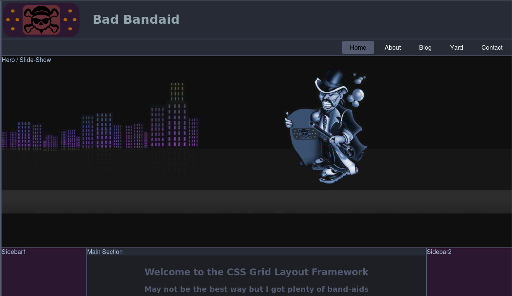

# Bad Band-aid CSS Grid Template Areas Framework

**This is an ongoing, responsive CSS Grid named template areas for my testing projects. The idea of the file structure was based on Hugo's  [Sass boilerplate](https://github.com/HugoGiraudel/sass-boilerplate). I made this one arranged with lettered named files and folders, "indexed" to keep it visually orgainized for text editors file tree hierarchy IMHO (or I'm just weird).**
## What's New:
- Color variables cut to a minimum of five, and are set from light to dark to create sets of themes easily for it to render site-wide.  -
***
 [CSS Grid Layout](https://developer.mozilla.org/en-US/docs/Web/CSS/CSS_Grid_Layout/Basic_Concepts_of_Grid_Layout) introduces a two-dimensional grid system to CSS. In addition, I gave it a bit of Flexbox to a full screen landing page thanks to [Traversy Media](https://www.youtube.com/channel/UC29ju8bIPH5as8OGnQzwJyA) for he's [tutorial ](https://www.youtube.com/watch?v=oRmQN244Ir0) that I have followed and borrowed from, Navigation bar is also flex-box, so I can have a reference of it in the mix as-well.
***

Indexed and structured with SCSS ([Sass](http://sass-lang.com/)) files and directories. It's butt ugly and basic but it's for visual feedback I guess. :)
***
